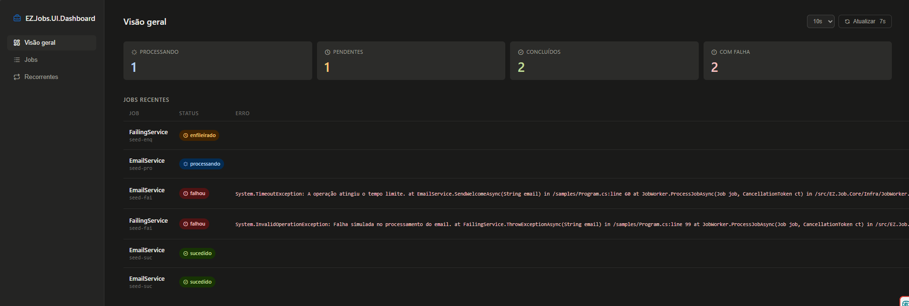
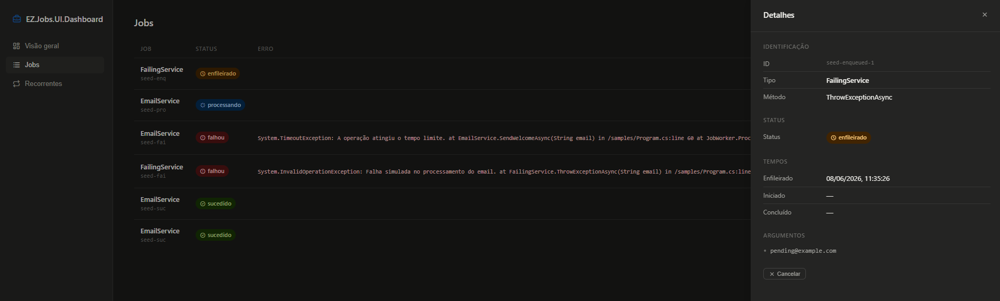
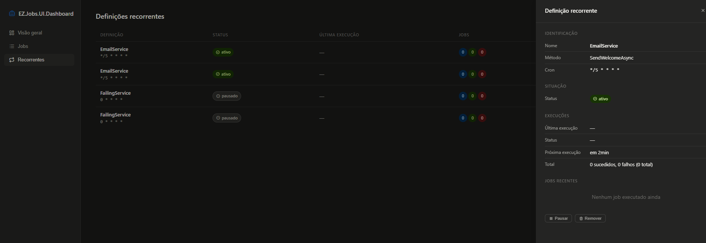

# EZ.Job.UI.Dashboard

Dashboard UI e endpoints JSON para monitoramento do [EZ.Job.Core](https://github.com/ez-dotnet/ez-job-core) e [EZ.Job.Recurring](https://github.com/ez-dotnet/ez-job-recurring).

## Instalação

```bash
dotnet add package EZ.Job.Core
dotnet add package EZ.Job.UI.Dashboard
```

## Uso

```csharp
using EZ.Job.Core;
using EZ.Job.UI.Dashboard;

var builder = WebApplication.CreateBuilder(args);

builder.Services.AddEZJobs();

var app = builder.Build();

app.UseEZJobsDashboard();

app.Run();
```

Acesse `http://localhost:5000/ez-jobs` para ver o dashboard.

### Opções

```csharp
app.UseEZJobsDashboard(o =>
{
    o.Route = "/dashboard";      // rota personalizada (padrão: /ez-jobs)
    o.DisableUI = true;          // apenas API JSON, sem HTML
});
```
## Sample

O projeto [`samples/EZ.Job.UI.Dashboard.Sample`](samples/EZ.Job.UI.Dashboard.Sample/) contém um exemplo funcional com:

- **Jobs** — enfileiramento com `IJobDispatcher` via `/enqueue` e `/enqueue-fail`
- **Seed** (`/seed`) — popula o dashboard com jobs de exemplo em vários estados (sucesso, falha, processando, pendente) e **2 definições recorrentes** para demonstrar a seção "Recorrentes" do dashboard

As definições recorrentes no seed são apenas ilustrativas — servem para mostrar como os dados são exibidos na interface, sem depender do EZ.Job.Recurring.

## Screenshots




